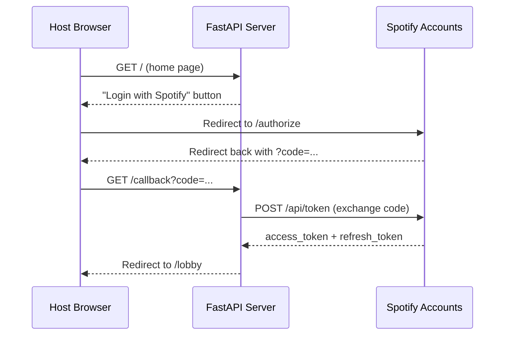
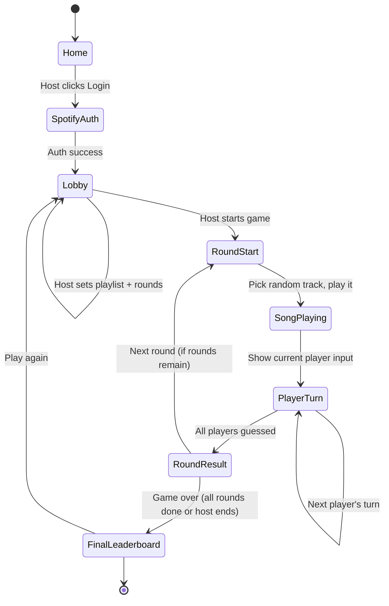

# Musically - Architecture and Design Plan

## Overview

A party-mode web game where players share one device, a song plays from a Spotify playlist, and each player takes turns guessing the song name via free text input with fuzzy matching. The host authenticates with Spotify and configures the game (playlist, number of rounds or endless mode).

## Tech Stack

- **Backend**: Python 3.12+ with **FastAPI** (async, modern, great Jinja2/template support)
- **Frontend**: HTML + **HTMX** for server-driven interactivity, minimal vanilla JS only for Spotify playback
- **Templating**: Jinja2 (via `fastapi` + `jinja2`)
- **Spotify Playback**: [Spotify Web Playback SDK](https://developer.spotify.com/documentation/web-playback-sdk) (JavaScript, requires Premium)
- **Spotify Data**: [Spotify Web API](https://developer.spotify.com/documentation/web-api) (fetch playlist tracks, metadata)
- **Fuzzy Matching**: `thefuzz` library (Levenshtein distance-based string matching)
- **State Management**: In-memory Python dataclasses (no database -- state lives only for the server process lifetime)
- **Package Manager**: [uv](https://docs.astral.sh/uv/)
- **No CSS framework**: Minimal browser-default styling

## Spotify Integration

### Authentication Flow



- **OAuth 2.0 Authorization Code** flow (not PKCE, since we have a server to keep the client secret safe)
- Scopes needed: `streaming`, `user-read-email`, `user-read-private`, `playlist-read-private`, `playlist-read-collaborative`
- Backend stores a single set of tokens in memory (one host per server process); a signed session cookie marks the host's browser as logged in
- A request counts as logged in only if the session cookie says so **and** tokens exist, since tokens are lost on server restart while the cookie survives
- Backend handles automatic token refresh when access token expires
- Playlist contents come from `GET /v1/playlists/{id}/items` (the `/tracks` endpoint was removed in the February 2026 Web API changes). Spotify only returns items for playlists the host owns or collaborates on. Local files and podcast episodes are skipped.

### Playback Architecture

- The **Spotify Web Playback SDK** runs in the browser as a JavaScript player instance
- It creates a virtual "device" in the user's Spotify account
- The **backend** tells Spotify which track to play on that device via the Web API (`PUT /v1/me/player/play`)
- The track name/artist is **never sent to the frontend** during a round -- not even the track URI reaches the browser
- A small `static/js/spotify-player.js` file initializes the player, fetches access tokens from `/game/token`, and reports player status (see "HTMX + Spotify JS Bridge")

## Game Flow



### Detailed Round Mechanics

1. Server picks a random track from the playlist (no repeats until the playlist is exhausted)
2. Server tells Spotify to play the track on the browser's player device (via the JS bridge)
3. UI shows "Player X's turn" with inputs for song title, artist (optional) and release year (optional) -- **the first player rotates each round** (round-robin) for fairness
4. Player submits a guess (HTMX `POST /game/guess`) or skips (`POST /game/skip`)
5. `GameState.submit_guess` fuzzy-matches song and artist, checks the year, and awards points
6. Next player's turn is shown (HTMX swap of the guess form area)
7. **Previous guesses are hidden** so later players cannot cheat
8. After the last player has guessed (or skipped), the round moves to `ROUND_RESULT` and the server reveals the answer and shows who got what right
9. Host clicks "Next Round" to continue, or "See Final Leaderboard" once all rounds are done

### Fuzzy Matching Rules

Implemented in `app/matching.py`:

- Both strings are normalized: Spotify version suffixes (`" - Remastered 2011"`) and bracketed parts (`"(feat. X)"`) are removed, then lowercase, punctuation stripped, leading "The" dropped
- Titles with a leading bracket like `"(I Can't Get No) Satisfaction"` match with or without the bracketed words
- Compare using `thefuzz.fuzz.token_sort_ratio`; **>= 75** counts as correct (handles typos and word order)
- There is deliberately no substring matching, so a single word from a longer title (e.g. "love") does not count
- Artist guesses match if they fit any of the track's artists
- Years must match exactly
- The round result shows the title without version info (`" - Remastered 2012"`, `"(Radio Edit)"`), but keeps other bracketed parts like `"(feat. X)"`

## Scoring

Point values come from the `[points]` table in `config.toml` (loaded by `app/game_config.py` into `ScoringConfig`). Defaults:

- **Correct song title**: 1 point (`song`)
- **Correct artist**: 1 point (`artist`)
- **Correct release year**: multiplies the points of that guess (`year_multiplier`, default 2; worth nothing on its own)
- All correct guessers in a round score equally, and the rotating start spreads any turn-order advantage
- Per-player totals of correct songs, artists and years are shown on the final leaderboard
- Per-game leaderboard only; resets when a new game starts
- Displayed after each round and as a final summary

## Release Year Enrichment

Spotify's album release date is often a remaster or compilation year. After a playlist is loaded, `app/musicbrainz.py` runs as a background `asyncio` task and looks up each track's earliest release year on MusicBrainz, overwriting the Spotify year only when MusicBrainz reports an earlier one.

- MusicBrainz allows 1 request per second, so the task sleeps between lookups
- The lobby polls `/lobby/enrichment-status` via HTMX until the task is done
- Loading another playlist cancels the running task before starting a new one
- The game can start before enrichment finishes. The task takes its next track from `GameState.tracks_to_verify()`, which re-evaluates the order on every step: the current round's track first, then the upcoming rounds in play order, then the rest of the playlist. A new round's year is therefore verified within a second or two
- Requests send a `User-Agent` with the app version and repository URL, as MusicBrainz requires

## Project Structure

```
musically/
├── app/
│   ├── __init__.py
│   ├── main.py              # FastAPI app, startup, middleware
│   ├── config.py             # Settings (Spotify client ID/secret, env vars)
│   ├── game_config.py        # Loads playlists and scoring from config.toml
│   ├── logging_config.py     # Log format and LOG_LEVEL
│   ├── middleware.py         # Request logging
│   ├── spotify.py            # Spotify Web API client (auth, playlist, playback)
│   ├── game.py               # Game state dataclasses and logic
│   ├── matching.py           # Fuzzy matching logic
│   ├── musicbrainz.py        # Original release year lookup
│   ├── project.py            # Version and repository URL from pyproject.toml
│   ├── templating.py         # Shared Jinja2Templates instance
│   ├── routes/
│   │   ├── __init__.py
│   │   ├── auth.py           # /login, /callback -- Spotify OAuth, is_logged_in
│   │   ├── lobby.py          # /lobby -- player registration, playlist, game config
│   │   └── game.py           # /game/* -- round play, guessing, leaderboard
│   └── templates/
│       ├── base.html          # Base layout (includes HTMX)
│       ├── home.html          # Landing page with "Login with Spotify"
│       ├── lobby.html         # Player names, playlist input, round config
│       ├── game.html          # Main game view (loads the Spotify SDK)
│       ├── partials/
│       │   ├── guess_form.html           # Current player's guess input
│       │   ├── lobby_player_update.html  # Player list plus out-of-band start form and messages
│       │   ├── messages.html             # Shared message pane; polls release year lookup
│       │   ├── messages_oob.html         # Out-of-band swap wrapper for messages.html
│       │   ├── player_list.html          # Registered players
│       │   ├── round.html                # Round header, scores and guess area; swapped per round
│       │   ├── round_result.html         # Round summary
│       │   ├── scoreboard.html           # Current scores
│       │   └── start_game_form.html      # Round count and start button
│       └── leaderboard.html   # Final game-over leaderboard
├── static/
│   ├── css/                   # app.css, lobby.css
│   └── js/
│       └── spotify-player.js  # Spotify Web Playback SDK init
├── tests/                     # Pytest suite, mirrors app/
├── docs/
│   └── architecture.md        # This file
├── config.toml                # Predefined playlists and scoring
├── Dockerfile, docker-compose.yml
├── render.yaml                # Render Blueprint (free web service, deploys on push)
├── pyproject.toml
├── .env.example               # Template for SPOTIFY_CLIENT_ID, SPOTIFY_CLIENT_SECRET
└── README.md
```

## Key Dependencies

- `fastapi` -- web framework
- `uvicorn` -- ASGI server
- `jinja2` -- HTML templating
- `httpx` -- async HTTP client for Spotify API calls
- `thefuzz[speedup]` -- fuzzy string matching
- `python-dotenv` -- load `.env` config
- `itsdangerous` -- secure cookie-based sessions
- `python-multipart` -- form data parsing

## HTMX + Spotify JS Bridge

Since HTMX drives the UI but Spotify playback requires JavaScript, a small bridge is needed:

- `game.html` contains a hidden HTMX form (`#play-track-form`, `hx-post="/game/play-track"`) with an empty `device_id` field
- When the SDK fires `ready`, the JS writes the device ID into that field and submits the form
- The server looks up the current round's track and starts playback on that device
- Only the first round loads `/game` as a full page. "Next Round" (`POST /game/next-round`) swaps `partials/round.html` into `#round`, so the SDK player and its device survive across rounds
- The swapped-in partial contains an element with `hx-trigger="load"` that posts to `/game/play-track` with `hx-include="#device-id"`, starting the new track without any extra JS. If the player isn't ready yet the device ID is empty, the request is a no-op, and the `ready` handler starts playback instead
- The partial also carries a top-level `<title>`, which htmx uses to update the document title
- `/game/next-round` only advances from `ROUND_RESULT`; a repeated click returns 204 so the page stays put
- Forms that stop the song ("Next Round", "End Game", "See Final Leaderboard") carry `data-fade-out`. A capture-phase `submit` listener in the JS holds the submission, fades the SDK volume to zero over 1.5 s, pauses, restores the volume, and then resubmits the form. Because it runs before htmx's own handler, the next track is only requested after the fade
- Mobile browsers block audio that doesn't start from a user gesture, and songs are started by the server. The first tap or form submit on the game page calls the SDK's `activateElement()` so later songs can play. If the SDK still reports `autoplay_failed`, a "Tap to start the music" button appears and restarts the song via `/game/play-track`. `activateElement()` only unlocks the SDK's media element before a song is loaded, so browsers that block autoplay strictly (e.g. Brave with autoplay blocked) can keep refusing. If the retry fails or doesn't play within 5 s, the status line asks the user to allow autoplay for the site
- The play/pause button in the status line fades out before pausing and fades back in to full volume on resume. All fades run one after another, and the button is disabled while any of them is in progress
- Reloading `/game` still works: the player reconnects and the current song restarts
- This keeps JS minimal and lets HTMX handle all game flow navigation

## Session Management

- A signed cookie (Starlette `SessionMiddleware`, backed by `itsdangerous`) stores the OAuth state and an `authenticated` flag
- Game state and Spotify tokens are process-wide singletons on `app.state`
- Single-session design: one active game per server process (party mode simplification)
- If needed later, multiple concurrent games can be supported by keying state on a session ID

## Configuration / Environment

Required environment variables (`.env`):
- `SPOTIFY_CLIENT_ID` -- from Spotify Developer Dashboard
- `SPOTIFY_CLIENT_SECRET` -- from Spotify Developer Dashboard
- `SPOTIFY_REDIRECT_URI` -- e.g. `http://127.0.0.1:8000/callback`
- `SECRET_KEY` -- for signing session cookies

## Open Design Notes

- **Endless mode**: When rounds are set to 0 (or "endless"), the game continues until the host clicks "End Game". The server keeps picking random songs (cycling through the playlist, re-shuffling if exhausted).
- **Skip**: Each player can skip their turn (no points, no penalty).
- **Song preview duration**: The full song plays until all players have guessed. No artificial time limit for MVP, but a configurable timer per turn could be added later.
