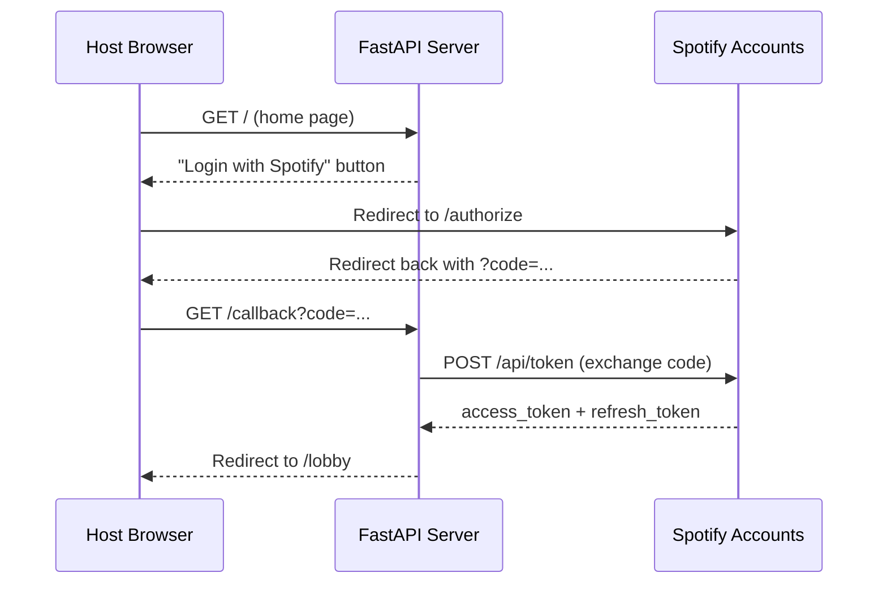
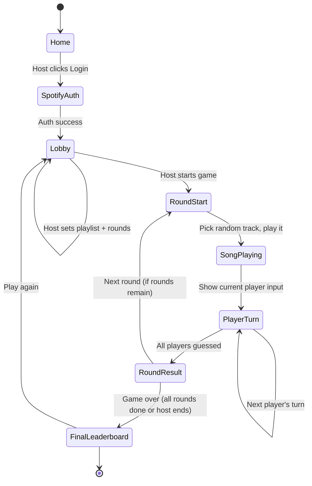

# Musically - Architecture and Design Plan

## Overview

A party-mode web game where players share one device, a song plays from a Spotify playlist, and each player takes turns guessing the song name via free text input with fuzzy matching. The host authenticates with Spotify and configures the game (playlist, number of rounds or endless mode).

## Tech Stack

- **Backend**: Python 3.12+ with **FastAPI** (async, modern, great Jinja2/template support)
- **Frontend**: HTML + **HTMX** for server-driven interactivity, minimal vanilla JS only for Spotify playback
- **Templating**: Jinja2 (via `fastapi` + `jinja2`)
- **Spotify Playback**: [Spotify Web Playback SDK](https://developer.spotify.com/documentation/web-playback-sdk) (JavaScript, requires Premium)
- **Spotify Data**: [Spotify Web API](https://developer.spotify.com/documentation/web-api) (fetch playlist tracks, metadata)
- **Fuzzy Matching**: `thefuzz` library (Levenshtein distance-based string matching)
- **State Management**: In-memory Python dataclasses (no database -- state lives only for the server process lifetime)
- **Package Manager**: [uv](https://docs.astral.sh/uv/)
- **No CSS framework**: Minimal browser-default styling

## Spotify Integration

### Authentication Flow



- **OAuth 2.0 Authorization Code** flow (not PKCE, since we have a server to keep the client secret safe)
- Scopes needed: `streaming`, `user-read-email`, `user-read-private`, `playlist-read-private`, `playlist-read-collaborative`
- Backend stores tokens in-memory per session (cookie-based session ID)
- Backend handles automatic token refresh when access token expires

### Playback Architecture

- The **Spotify Web Playback SDK** runs in the browser as a JavaScript player instance
- It creates a virtual "device" in the user's Spotify account
- The **backend** tells the SDK which track URI to play via the Spotify Web API (`PUT /v1/me/player/play`)
- The track name/artist is **never sent to the frontend** -- only the track URI reaches the JS player
- A small `static/js/spotify-player.js` file handles: player initialization, receiving play commands, and exposing a play/pause interface

## Game Flow



### Detailed Round Mechanics

1. Server picks a random track from the playlist (no repeats within a game)
2. Server tells the Spotify player to play the track URI (via HTMX-triggered JS bridge)
3. UI shows "Player X's turn" with a text input -- **player order is shuffled each round** for fairness
4. Player types a guess and submits (HTMX `POST /game/guess`)
5. Server fuzzy-matches the guess against the song title (and optionally artist)
6. Input clears, next player's turn is shown (HTMX swap of the guess form area)
7. **Previous guesses are hidden** so later players cannot cheat
8. After all players have guessed (or skipped), server reveals the answer and shows who got it right
9. Host clicks "Next Round" to continue (or game auto-detects if all rounds are done)

### Fuzzy Matching Rules

- Compare against **song title** using `thefuzz.fuzz.token_sort_ratio`
- Threshold: **>= 75** counts as correct (handles typos, word order, missing "The", etc.)
- Optional: also accept a match against **artist name** for partial credit or bonus points (configurable later)
- Normalize both strings: lowercase, strip punctuation, strip common prefixes like "The"

## Scoring

- **Correct guess**: 1 point
- All correct guessers in a round score equally (no advantage to turn order since order is shuffled)
- Per-game leaderboard only; resets when a new game starts
- Displayed after each round and as a final summary

## Project Structure

```
musically/
├── app/
│   ├── __init__.py
│   ├── main.py              # FastAPI app, startup, middleware
│   ├── config.py             # Settings (Spotify client ID/secret, env vars)
│   ├── spotify.py            # Spotify Web API client (auth, playlist, playback)
│   ├── game.py               # Game state dataclasses and logic
│   ├── matching.py           # Fuzzy matching logic
│   ├── routes/
│   │   ├── __init__.py
│   │   ├── auth.py           # /login, /callback -- Spotify OAuth
│   │   ├── lobby.py          # /lobby -- player registration, game config
│   │   └── game.py           # /game/* -- round play, guessing, leaderboard
│   └── templates/
│       ├── base.html          # Base layout (includes HTMX, Spotify SDK)
│       ├── home.html          # Landing page with "Login with Spotify"
│       ├── lobby.html         # Player names, playlist input, round config
│       ├── game.html          # Main game view (player, song playing indicator)
│       ├── partials/
│       │   ├── guess_form.html    # HTMX partial: current player's guess input
│       │   ├── round_result.html  # HTMX partial: round summary
│       │   └── scoreboard.html    # HTMX partial: current scores
│       └── leaderboard.html   # Final game-over leaderboard
├── static/
│   └── js/
│       └── spotify-player.js  # Spotify Web Playback SDK init and controls
├── docs/
│   └── architecture.md        # This file
├── pyproject.toml
├── .env.example               # Template for SPOTIFY_CLIENT_ID, SPOTIFY_CLIENT_SECRET
└── README.md
```

## Key Dependencies

- `fastapi` -- web framework
- `uvicorn` -- ASGI server
- `jinja2` -- HTML templating
- `httpx` -- async HTTP client for Spotify API calls
- `thefuzz[speedup]` -- fuzzy string matching
- `python-dotenv` -- load `.env` config
- `itsdangerous` -- secure cookie-based sessions
- `python-multipart` -- form data parsing

## HTMX + Spotify JS Bridge

Since HTMX drives the UI but Spotify playback requires JavaScript, a small bridge is needed:

- The game page template includes a `<div id="player-controls">` managed by JS
- When HTMX swaps in a new round, the server includes a `data-track-uri` attribute on a hidden element
- A small JS `MutationObserver` (or HTMX `htmx:afterSwap` event listener) detects the new track URI and calls `player.play(uri)` on the Spotify SDK instance
- This keeps JS minimal and lets HTMX handle all game flow navigation

## Session Management

- A signed cookie stores a session ID (using `itsdangerous`)
- Server-side dict maps session IDs to game state objects
- Single-session design: one active game per server process (party mode simplification)
- If needed later, multiple concurrent games can be supported by keying on session ID

## Configuration / Environment

Required environment variables (`.env`):
- `SPOTIFY_CLIENT_ID` -- from Spotify Developer Dashboard
- `SPOTIFY_CLIENT_SECRET` -- from Spotify Developer Dashboard
- `SPOTIFY_REDIRECT_URI` -- e.g. `http://127.0.0.1:8000/callback`
- `SECRET_KEY` -- for signing session cookies

## Open Design Notes

- **Endless mode**: When rounds are set to 0 (or "endless"), the game continues until the host clicks "End Game". The server keeps picking random songs (cycling through the playlist, re-shuffling if exhausted).
- **Skip**: Each player can skip their turn (no points, no penalty).
- **Song preview duration**: The full song plays until all players have guessed. No artificial time limit for MVP, but a configurable timer per turn could be added later.
